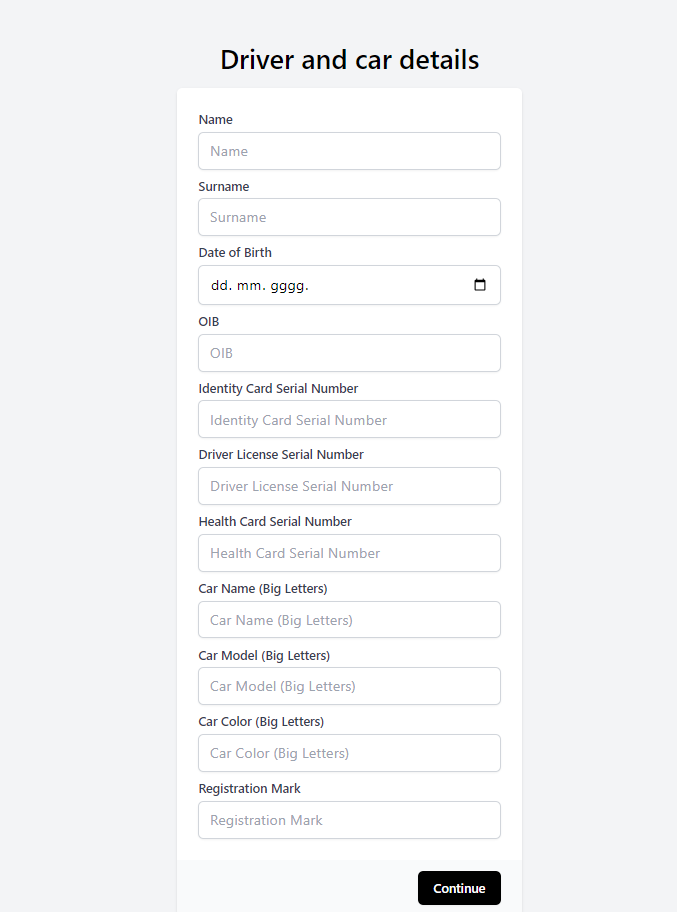
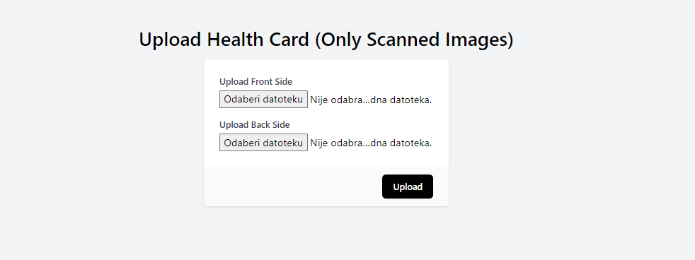
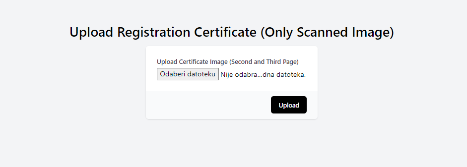
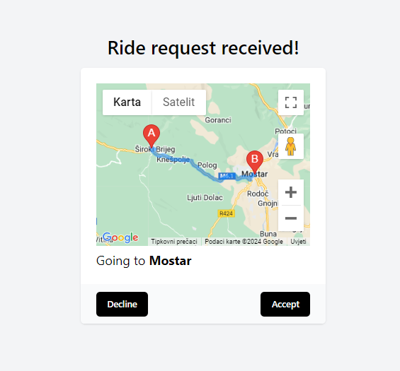

# Trip Harmony

&nbsp;

**Trip Harmony** je aplikacija koja na jednostavan način povezuje vozače i putnike, omogućujući korisnicima da brzo pronađu ili ponude vožnju. Vozači čekaju zahtjeve za vožnju, dok putnici jednostavno unose destinaciju i potvrđuju svoj zahtjev. Kroz aplikaciju se prate lokacije putnika i vozača u stvarnom vremenu, omogućujući efikasno i sigurno putovanje. Aplikacija je izrađena u sklopu projekta za kolegij **Elektroničko poslovanje**.

---

&nbsp;

## Članovi tima

- **Hrvoje Sesar**
- **Franjo Lovrić**
- **Antonio Šego**
- **Filip Buntić**

---

&nbsp;

## Tablica sadržaja

- [Tehnologije](#tehnologije)
  - [Backend tehnologije](#backend-tehnologije)
  - [Frontend tehnologije](#frontend-tehnologije)
- [Značajke](#značajke)
  - [Putnici](#putnici)
  - [Vozači](#vozači)
- [Upute za pokretanje](#upute-za-pokretanje)
  - [Preduvjeti](#preduvjeti)
  - [Instalacija](#instalacija)
  - [Backend](#backend)
  - [Frontend](#frontend)
- [Demo aplikacije](#demo-aplikacije)

---

&nbsp;

## Tehnologije

### Backend tehnologije

<div style="display: flex; justify-content: space-around; padding: 10px; margin: 10px; border: 1px solid #ccc; border-radius: 5px;">
  <a href="https://laravel.com/"></a>
  <a href="https://www.mysql.com/"></a>
</div>

### Frontend tehnologije

<div style="display: flex; justify-content: space-around; padding: 10px; margin: 10px; border: 1px solid #ccc; border-radius: 5px;">
  <a href="https://vuejs.org/"></a>
  <a href="https://tailwindcss.com/"></a>
</div>

&nbsp;

## Značajke

### Putnici

- **Autentikacija u aplikaciju**: Unošenjem broja mobitela i potvrdom koda, putnici se prijavljuju u aplikaciju
- **Odabir destinacije**: Putnici unose i odabiru željenu destinaciju
- **Pregled putovanja**: Nakon unosa destinacije, putnici mogu pregledati plan putovanja na karti i potvrditi svoj zahtjev
- **Početak putovanja**: Nakon što vozač prihvati zahtjev putnika, putnik vidi lokaciju vozača, kao i ostale relevantne informacije o vozaču i putovanju
- **Tijek putovanja**: Za vrijeme putovanja, putniku je omogućeno praćenje lokacije u stvarnom vremenu
- **Završetak putovanja**: Nakon završetka putovanja, putniku se ispisuje odgovarajuća poruka te ga se preusmjerava na početni zaslon

### Vozači

- **Autentikacija u aplikaciju**: Unošenjem broja mobitela i potvrdom koda, vozači se prijavljuju u aplikaciju
- **Registracija vozača**: Vozači unose potrebne informacije o sebi i svom vozilu te im se dodjeljuje status vozača
- **Pregled zahtjeva**: Vozači čekaju zahtjeve putnika za vožnju, pregledavaju ih i odlučuju hoće li ih prihvatiti
- **Vožnja do putnika**: Nakon prihvaćanja zahtjeva, vozači se kreću prema lokaciji putnika 
- **Početak putovanja**: Nakon dolaska na lokaciju putnika, vozači započinju putovanje prema konačnoj destinaciji
- **Tijek putovanja**: Za vrijeme putovanja, vozačima je omogućeno praćenje lokacije u stvarnom vremenu
- **Završetak putovanja**: Nakon završetka putovanja, vozače se preusmjerava natrag te čekaju buduće zahtjeve putnika

---

&nbsp;

## Upute za pokretanje

### Preduvjeti

<div style="display: flex; justify-content: space-around; padding: 10px; margin: 10px; border: 1px solid #ccc; border-radius: 5px;">
  <a href="https://php.net/"></a>
    <a href="https://getcomposer.org/"></a>
    <a href="https://www.apachefriends.org/index.html"></a>
    <a href="https://nodejs.org/en/"></a>
    <a href="https://www.npmjs.com/"></a>
    <a href="https://www.git-scm.com/"></a>
</div>

### Instalacija

1. Klonirajte repozitorij na svoje računalo:
   ```sh
   git clone https://github.com/hrvojesesar/trip-harmony.git
    ```
2. Korištenjem editora poput Visual Studio Code-a, otvorite projekt.

### Backend

1. Pomoću terminala, prebacite se u direktorij **backend**: <br>
   `cd backend`
2. Instalirajte sve PHP ovisnosti: <br>
   `composer install`
3. Kopirajte **.env.example** datoteku i preimenujte ju u **.env**: <br>
   `cp .env.example .env`
4. Generirajte ključ aplikacije: <br>
   `php artisan key:generate`
5. Pokrenite migracije za kreiranje tablica u bazi podataka: <br>
   `php artisan migrate`
6. Pokrenite Laravel development server: <br>
    `php artisan serve`

### Frontend

1. Pomoću terminala, prebacite se u direktorij **frontend**: <br>
   `cd frontend`
2. Instalirajte sve JavaScript ovisnosti: <br>
    `npm install`
3. Pokrenite Vue development server: <br>
    `npm run dev`

---

&nbsp;

## Demo aplikacije

<p>
   
   
   
   
   
   
   
   
   
   
   
   
   
   
   
<p>

---

&nbsp;